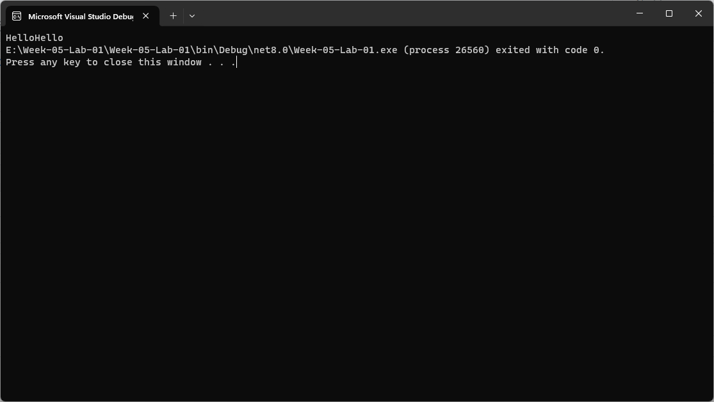
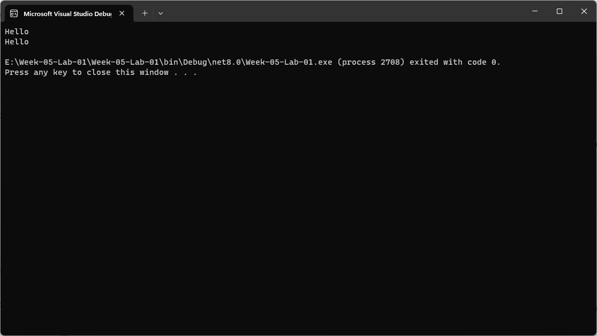
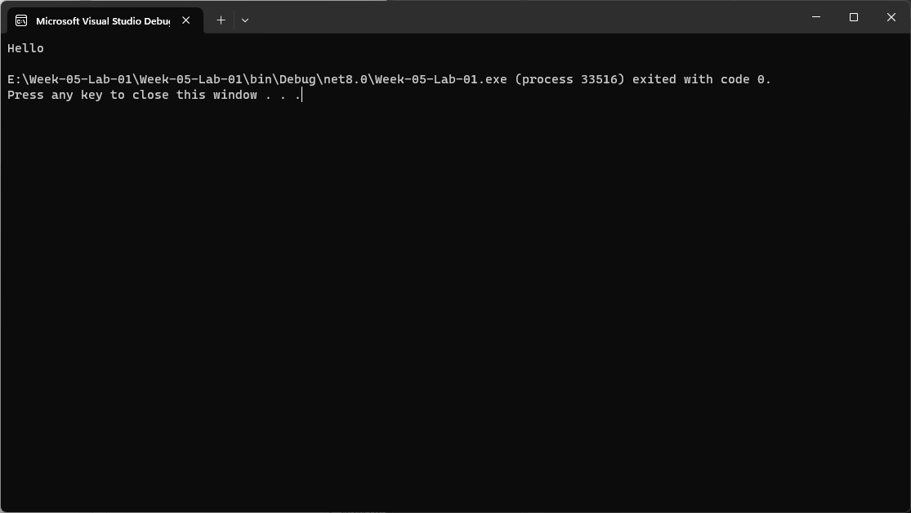
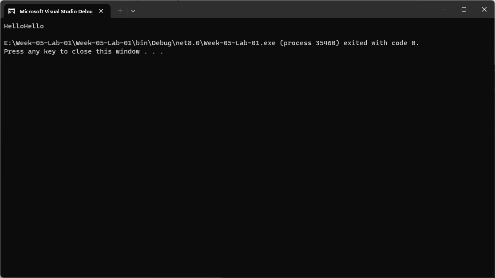

# 65030258 สิทธา กล้าพานิช
# Lab-01 Part 2~3 คำสั่ง Console.Write() และ Console.WriteLine()

## 2. การใช้เมดธอด Console.Write()

### 2.1 การใช้เมดธอด Console.Write()
👉 แก้ไขโปรแกรม ให้เป็นดังด้านล่างนี้

```csharp
Console.Write("Hello");
Console.Write("Hello");
```

➢ รันโปรแกรมและบันทึกผล



❔ ผลที่ได้จากการทดลอง เป็นอย่างที่นักศึกษาคิดหรือไม่ อย่างไร จงอธิบาย

#### แสดงผล Hello ติดกัน เป็นอย่างที่คิดเพราะไม่ได้ใช้ WriteLine เพื่อสั่งให้เว้นบรรทัด หรือใช้ Environment.NewLine

### 2.2 การใช้เมดธอด Console.Write() ร่วมกับ  `Environment.NewLine`

`Environment.NewLine` เป็นค่าคงที่ที่ถูกนิยามในภาษา C# เพื่อใช้สำหรับการส่งอักขระขึ้นบรรทัดใหม่ไปยัง console

👉 แก้ไขโปรแกรม ให้เป็นดังด้านล่างนี้

```csharp
Console.Write("Hello" + Environment.NewLine);
Console.Write("Hello" + Environment.NewLine);
```

➢ รันโปรแกรมและบันทึกผล



❔ ผลที่ได้จากการทดลอง เป็นอย่างที่นักศึกษาคิดหรือไม่ อย่างไร จงอธิบาย

#### แสดง Hello เว้นบรรทัด เป็นอย่างที่คิดเพราะใช้คำสั่ง Environment.NewLine ให้ขึ้นบรรทัดใหม่

## 3. เมดธอด Console.WriteLine()

`Console.WriteLine()` เป็นคำสั่งที่เทียบเท่ากับการใช้  `Console.Write` ร่วมกับ  `Environment.NewLine` ทำให้ประหยัดเวลาในการเขียนโปรแกรม
👉 แก้โปรแกรมในเมดธอด Main() ให้เป็นดังต่อไปนี้

```csharp
Console.WriteLine("Hello");
```

➢ รันโปรแกรมและบันทึกผล



👉 แก้ไขโปรแกรม ให้เป็นดังรูปด้านล่างนี้

```csharp
Console.Write("Hello, ");
Console.WriteLine("World!");
```

➢ รันโปรแกรมและบันทึกผล



❔ ผลที่ได้จากการทดลอง เป็นอย่างที่นักศึกษาคิดหรือไม่ อย่างไร จงอธิบาย

#### ได้อย่างที่คิดเพราะใช้คำสั่งที่แตกต่างกันอย่างเห็นได้ชัด Console.Write() ให้แสดงผลข้อมูลโดยไม่เว้นบรรทัด Console.WriteLine() ให้แสดงผลข้อมูลโดยเว้นบรรทัด

❔ จงอธิบายความแตกต่างระหว่างคำสั่ง Console.Write() และ Console.WriteLine()

#### Console.Write()กับ Console.WriteLine() ทั้งคู่จะให้แสดงผลข้อมูลผ่านหน้าจอ เหมือนกัน แต่แตกต่างกันตรงที่ Console.WriteLine() จะเป็นการแสดงผลสู่หน้าจอโดยเว้นบรรทัด

## [4. จำนวนของอาร์กิวเมนต์ในคำสั่ง Console.WriteLine()](./Lab-01-part-4.md)
